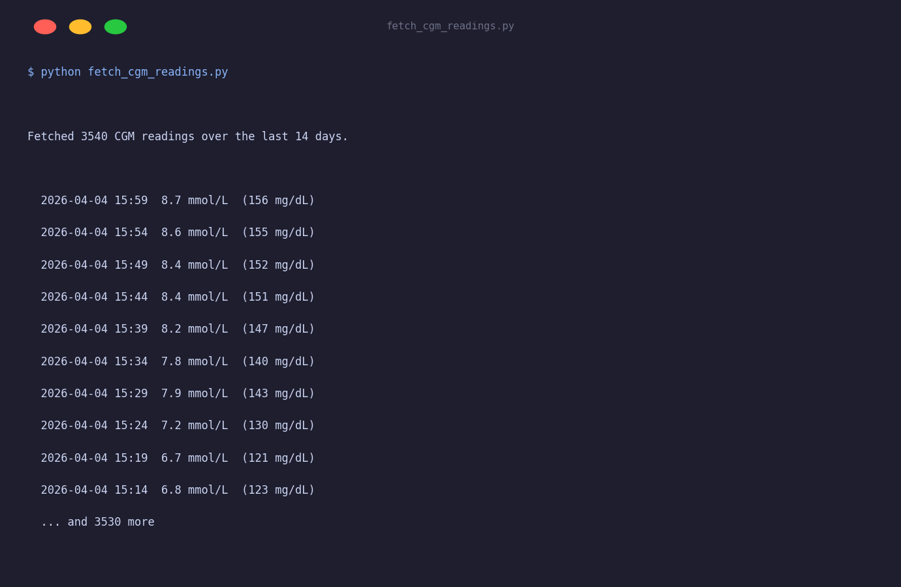

# Fetch CGM Readings

Fetches continuous glucose monitor (CGM) readings for a user and prints them to the terminal. Demonstrates date-range filtering and the `cbg` data type.

## Output



## Setup

```bash
export TIDEPOOL_USERNAME=your@email.com
export TIDEPOOL_PASSWORD=yourpassword
export TIDEPOOL_USER_ID=your-user-id
```

Your user ID can be found by decoding the `sub` claim from your session token, or by inspecting the Tidepool web app network requests.

## Run

```bash
python fetch_cgm_readings.py
```

## What it does

1. Opens a `TidepoolClient` session using username/password.
2. Calls `client.data.get()` with `data_types=[DiabetesType.CBG]` and a 14-day window.
3. Prints each reading's timestamp, mmol/L value, and mg/dL equivalent.

## Key API used

```python
readings = client.data.get(
    user_id,
    data_types=[DiabetesType.CBG],
    start_date=...,
    end_date=...,
)
```

`readings` is a `list[CbgReading]`. Each `CbgReading` has:

| Field | Type | Description |
|---|---|---|
| `time` | `datetime` | UTC timestamp of the reading |
| `value` | `float` | Glucose in mmol/L |
| `units` | `str` | Always `"mmol/L"` for CBG |

To convert to mg/dL: `value * 18.0182`.
