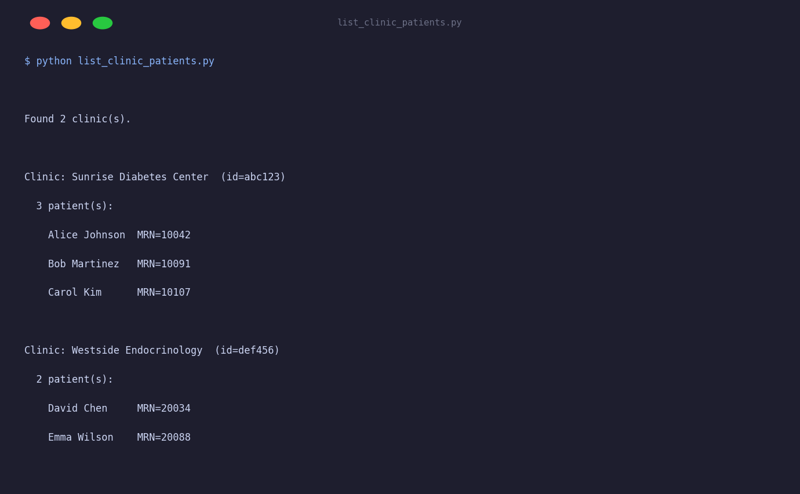

# List Clinic Patients

Lists all patients across all clinics accessible to a clinician account. Uses OAuth2 client credentials (server-to-server) rather than username/password — the typical flow for clinic integrations.

## Output



## Setup

You need a **clinician account** with clinic access and an OAuth2 client application registered with Tidepool.

```bash
export TIDEPOOL_CLIENT_ID=your-client-id
export TIDEPOOL_CLIENT_SECRET=your-client-secret
```

> Personal user accounts return a 403 on the `/v1/clinics` endpoint. The script catches this and prints a helpful message.

## Run

```bash
python list_clinic_patients.py
```

## What it does

1. Opens a `TidepoolClient` session using client credentials.
2. Calls `client.clinics.list()` to enumerate all accessible clinics.
3. For each clinic, calls `client.clinics.get_patients(clinic_id)` and prints the patient roster.

## Key API used

```python
clinics = client.clinics.list()                        # → list[Clinic]
patients = client.clinics.get_patients(clinic_id)      # → list[Patient]
```

`Clinic` fields:

| Field | Type | Description |
|---|---|---|
| `id` | `str \| None` | Clinic ID |
| `name` | `str \| None` | Display name |
| `city` | `str \| None` | Location |

`Patient` fields:

| Field | Type | Description |
|---|---|---|
| `id` | `str \| None` | Tidepool user ID |
| `full_name` | `str \| None` | Patient name |
| `mrn` | `str \| None` | Medical record number |
| `permissions` | `PatientPermissions \| None` | Access flags |

## Pagination

For large clinics, use `limit` and `offset` to page through results:

```python
page1 = client.clinics.get_patients(clinic_id, limit=100, offset=0)
page2 = client.clinics.get_patients(clinic_id, limit=100, offset=100)
```
