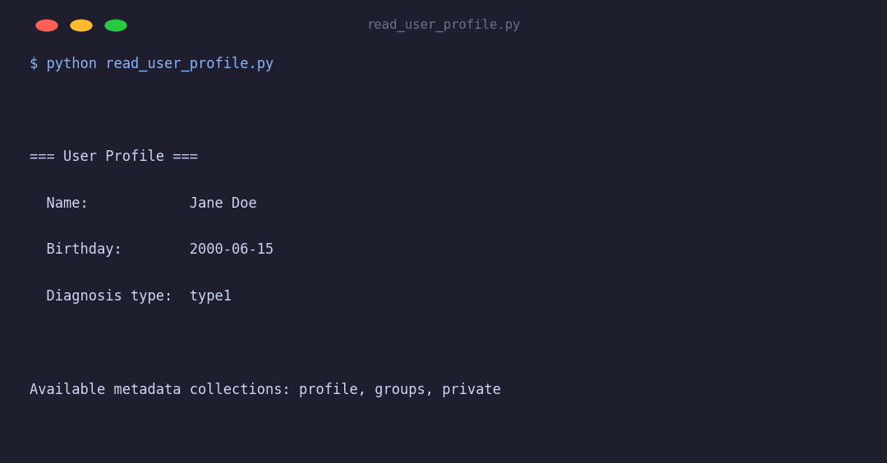

# Read User Profile

Reads a user's Tidepool profile and lists available metadata collections. Shows how to access demographic information stored in the `profile` metadata collection.

## Output



## Setup

```bash
export TIDEPOOL_USERNAME=your@email.com
export TIDEPOOL_PASSWORD=yourpassword
export TIDEPOOL_USER_ID=your-user-id
```

## Run

```bash
python read_user_profile.py
```

## What it does

1. Calls `client.metadata.get_profile(user_id)` to fetch the parsed `UserProfile`.
2. Calls `client.metadata.get_collections()` to list all metadata collection names for the account.
3. Prints name, birthday, and diagnosis type from the profile.

## Key API used

```python
profile = client.metadata.get_profile(user_id)   # → UserProfile
collections = client.metadata.get_collections()   # → list[str]
```

`UserProfile` fields:

| Field | Type | Description |
|---|---|---|
| `full_name` | `str \| None` | Display name |
| `patient` | `PatientInfo \| None` | Diabetes-specific demographics |

`PatientInfo` fields:

| Field | Type | Description |
|---|---|---|
| `birthday` | `str \| None` | ISO date string (`YYYY-MM-DD`) |
| `diagnosis_type` | `str \| None` | e.g. `"type1"`, `"type2"`, `"gestational"` |
| `diagnosis_date` | `str \| None` | ISO date of diagnosis |

## Raw metadata access

For collections that don't have a typed wrapper, use the raw dict interface:

```python
raw = client.metadata.get(user_id, "profile")   # → dict[str, Any]
```
