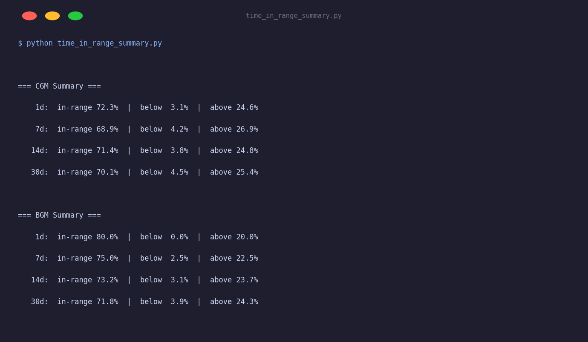

# Time-in-Range Summary

Fetches CGM and BGM glucose summary statistics and prints time-in-range percentages across four reporting windows: 1 day, 7 days, 14 days, and 30 days.

## Output



## Setup

```bash
export TIDEPOOL_USERNAME=your@email.com
export TIDEPOOL_PASSWORD=yourpassword
export TIDEPOOL_USER_ID=your-user-id
```

## Run

```bash
python time_in_range_summary.py
```

## What it does

1. Calls `client.summary.get_cgm(user_id)` and `client.summary.get_bgm(user_id)`.
2. Iterates over the `periods` dict (keys: `"1d"`, `"7d"`, `"14d"`, `"30d"`).
3. Prints `target_percent`, `low_percent`, and `high_percent` for each window.

## Key API used

```python
cgm = client.summary.get_cgm(user_id)   # → CgmSummary
bgm = client.summary.get_bgm(user_id)   # → BgmSummary
```

`CgmSummary.periods` is a `dict[str, SummaryPeriod]`. Each `SummaryPeriod` has a `time_in_range: TimeInRange | None` with these fields:

| Field | Type | Description |
|---|---|---|
| `target_percent` | `float \| None` | % of readings within target range (70–180 mg/dL) |
| `low_percent` | `float \| None` | % of readings below target |
| `high_percent` | `float \| None` | % of readings above target |

## Clinical context

The international consensus targets for CGM time-in-range are:

| Zone | Target |
|---|---|
| In range (70–180 mg/dL) | > 70% |
| Below range (< 70 mg/dL) | < 4% |
| Very low (< 54 mg/dL) | < 1% |
