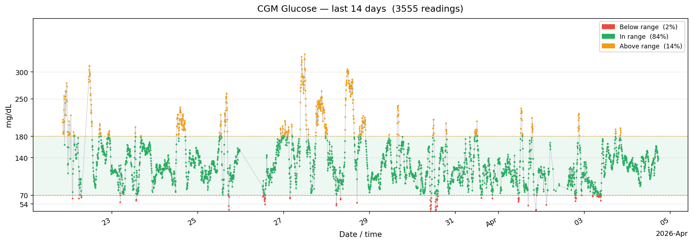

# Visualize CGM Data

Plots CGM glucose readings as an annotated time-series chart with color-coded range zones and time-in-range statistics. Each dot is colored green (in range), red (below range), or amber (above range).

## Screenshot



## Dependencies

Requires `matplotlib` in addition to `pytidepool`:

```bash
pip install matplotlib
# or
uv add matplotlib
```

## Setup

```bash
export TIDEPOOL_USERNAME=your@email.com
export TIDEPOOL_PASSWORD=yourpassword
export TIDEPOOL_USER_ID=your-user-id
```

## Run

```bash
python visualize_cgm.py
```

## Options

Control the chart via environment variables — no code changes needed:

| Variable | Default | Description |
|---|---|---|
| `TIDEPOOL_DAYS` | `14` | Days of history to fetch |
| `TIDEPOOL_UNITS` | `mgdl` | Display units: `mgdl` or `mmol` |

Examples:

```bash
# Last 7 days in mmol/L
TIDEPOOL_DAYS=7 TIDEPOOL_UNITS=mmol python visualize_cgm.py

# Last 30 days in mg/dL
TIDEPOOL_DAYS=30 python visualize_cgm.py
```

## What it does

1. Fetches all `cbg` readings in the requested window via `client.data.get()`.
2. Converts to mg/dL (or keeps mmol/L) and assigns each point a colour:
   - **Green** — within target range (70–180 mg/dL / 3.9–10.0 mmol/L)
   - **Red** — below range
   - **Amber** — above range
3. Draws a shaded target-range band and dashed threshold lines.
4. Computes and shows time-in-range percentages in the legend.
5. Opens the chart in an interactive matplotlib window.

## Range thresholds

The thresholds match the international consensus targets:

| Zone | mg/dL | mmol/L |
|---|---|---|
| Low | < 70 | < 3.9 |
| Target | 70 – 180 | 3.9 – 10.0 |
| High | > 180 | > 10.0 |
